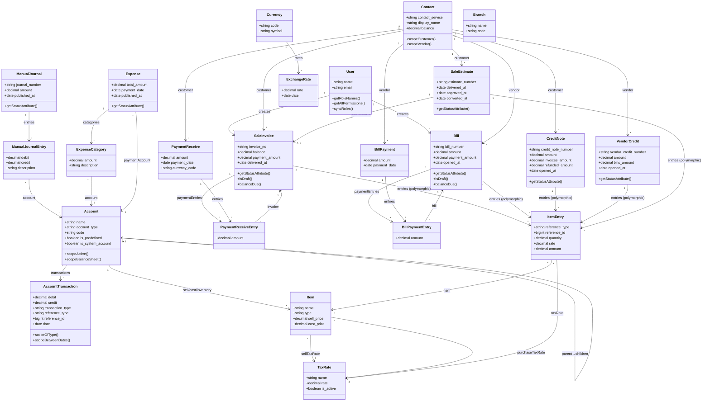
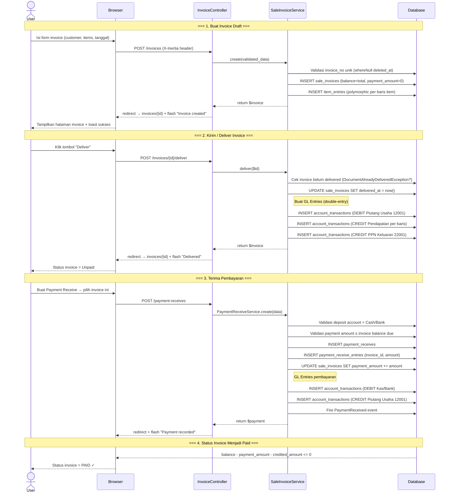
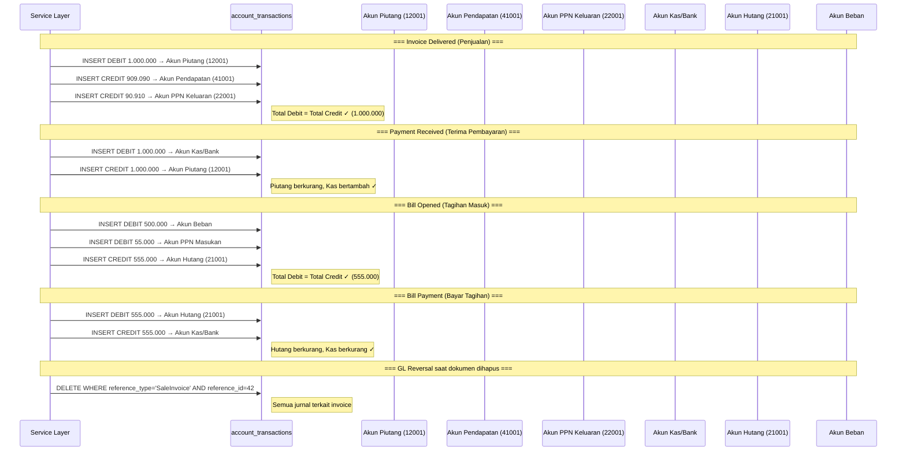
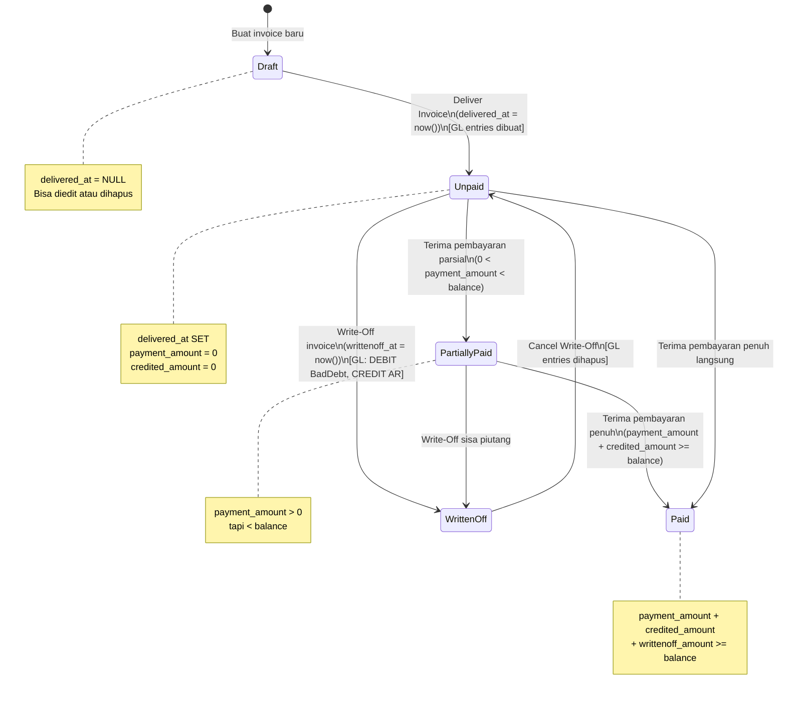
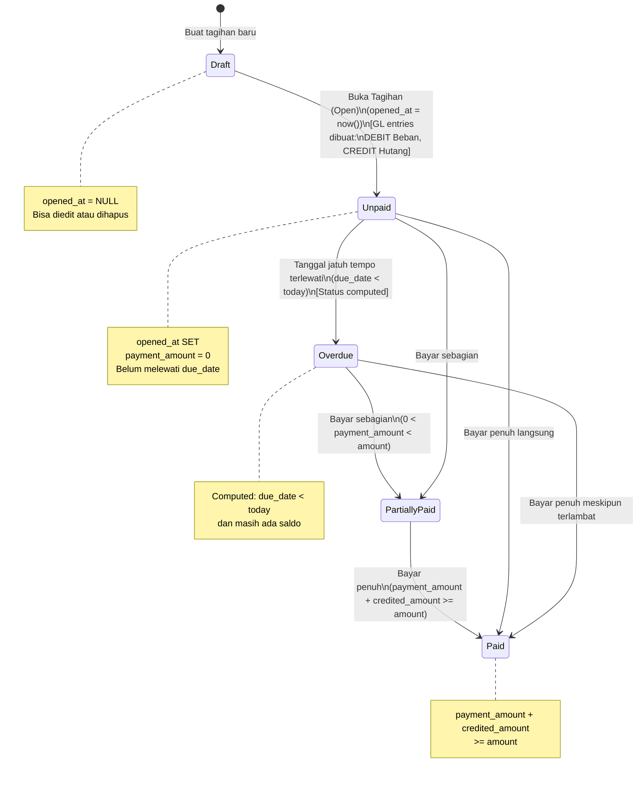
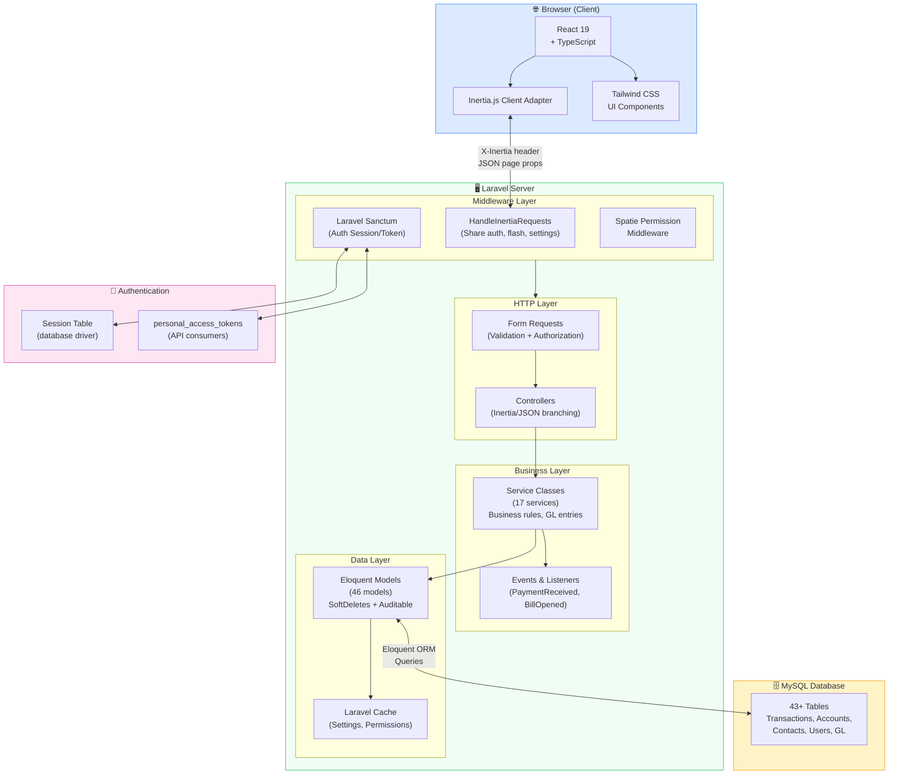
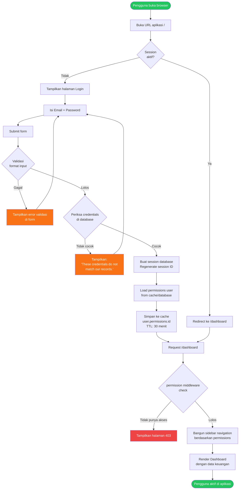

# UML Diagrams — ERP Finance & Accounting

Semua diagram menggunakan sintaks **Mermaid** dan dapat di-render di GitHub, GitLab, Notion, atau tools Markdown lainnya.

---

## DIAGRAM 1 — Use Case Diagram

Aktor dan use case yang tersedia per modul.

```mermaid
flowchart TD
    Admin([👤 Admin])
    Staff([👤 Staff])
    Viewer([👤 Viewer])

    subgraph AUTH["🔐 Autentikasi"]
        UC1[Login ke Sistem]
        UC2[Logout]
    end

    subgraph DASHBOARD["📊 Dashboard"]
        UC3[Lihat Ringkasan Keuangan]
    end

    subgraph AR["💰 Finance — Piutang A/R"]
        UC4[Buat / Edit Invoice]
        UC5[Kirim Invoice ke Pelanggan]
        UC6[Write-Off Invoice]
        UC7[Hapus Invoice]
        UC8[Duplikasi Invoice]
        UC9[Buat / Edit Estimasi]
        UC10[Konversi Estimasi ke Invoice]
        UC11[Buat Nota Kredit]
        UC12[Terapkan Nota Kredit ke Invoice]
        UC13[Refund Nota Kredit]
        UC14[Catat Penerimaan Pembayaran]
        UC15[Hapus Penerimaan Pembayaran]
    end

    subgraph AP["🧾 Finance — Hutang A/P"]
        UC16[Buat / Edit Tagihan Bill]
        UC17[Buka Tagihan]
        UC18[Duplikasi Tagihan]
        UC19[Hapus Tagihan]
        UC20[Buat Kredit Vendor]
        UC21[Terapkan Kredit Vendor ke Tagihan]
        UC22[Catat Pembayaran Tagihan]
        UC23[Hapus Pembayaran Tagihan]
    end

    subgraph ACC["📒 Akuntansi"]
        UC24[Lihat Bagan Akun]
        UC25[Buat / Edit Akun]
        UC26[Hapus Akun]
        UC27[Buat / Edit Jurnal Manual]
        UC28[Posting Jurnal ke Buku Besar]
        UC29[Hapus Jurnal]
        UC30[Buat / Edit Pengeluaran]
        UC31[Posting Pengeluaran]
        UC32[Hapus Pengeluaran]
    end

    subgraph REPORT["📈 Laporan Keuangan"]
        UC33[Lihat Neraca]
        UC34[Lihat Laba Rugi]
        UC35[Lihat Neraca Saldo]
        UC36[Lihat Arus Kas]
        UC37[Lihat Aging Piutang]
        UC38[Lihat Aging Hutang]
        UC39[Lihat Ringkasan Pajak]
    end

    subgraph SETTINGS["⚙️ Pengaturan"]
        UC40[Kelola Pengaturan Organisasi]
        UC41[Kelola Mata Uang dan Kurs]
        UC42[Kelola Tarif Pajak]
        UC43[Kelola Item / Produk]
        UC44[Kelola Kontak Pelanggan dan Vendor]
        UC45[Kelola Pengguna]
    end

    %% Admin → semua use case
    Admin --> UC1 & UC2 & UC3
    Admin --> UC4 & UC5 & UC6 & UC7 & UC8
    Admin --> UC9 & UC10 & UC11 & UC12 & UC13 & UC14 & UC15
    Admin --> UC16 & UC17 & UC18 & UC19 & UC20 & UC21 & UC22 & UC23
    Admin --> UC24 & UC25 & UC26 & UC27 & UC28 & UC29 & UC30 & UC31 & UC32
    Admin --> UC33 & UC34 & UC35 & UC36 & UC37 & UC38 & UC39
    Admin --> UC40 & UC41 & UC42 & UC43 & UC44 & UC45

    %% Staff → buat/edit, tidak bisa hapus atau pengaturan
    Staff --> UC1 & UC2 & UC3
    Staff --> UC4 & UC5 & UC8 & UC9 & UC10 & UC11 & UC12 & UC13 & UC14
    Staff --> UC16 & UC17 & UC18 & UC20 & UC21 & UC22
    Staff --> UC24 & UC27 & UC28 & UC30 & UC31
    Staff --> UC33 & UC34 & UC35 & UC36 & UC37 & UC38 & UC39

    %% Viewer → lihat saja
    Viewer --> UC1 & UC2 & UC3
    Viewer --> UC33 & UC34 & UC35 & UC36 & UC37 & UC38 & UC39
    Viewer --> UC24
```

---

## DIAGRAM 2 — Entity Relationship Diagram (ERD)

Entitas utama dan relasi antar tabel database.

```mermaid
erDiagram
    users {
        bigint id PK
        string name
        string email UK
        string password
        bigint created_by
        bigint updated_by
        timestamp deleted_at
    }

    roles {
        bigint id PK
        string name UK
        string guard_name
    }

    permissions {
        bigint id PK
        string name UK
        string guard_name
    }

    currencies {
        bigint id PK
        string name
        string code UK
        string symbol
        timestamp deleted_at
    }

    exchange_rates {
        bigint id PK
        bigint currency_id FK
        decimal rate
        date date
    }

    accounts {
        bigint id PK
        string name
        string account_type
        string code
        bigint parent_account_id FK
        boolean is_active
        boolean is_predefined
        boolean is_system_account
        decimal balance
        string currency_code
        timestamp deleted_at
    }

    contacts {
        bigint id PK
        string contact_service
        string display_name
        string email
        decimal balance
        string currency_code
        timestamp deleted_at
    }

    tax_rates {
        bigint id PK
        string name
        decimal rate
        boolean is_active
        timestamp deleted_at
    }

    items {
        bigint id PK
        string name
        string type
        decimal sell_price
        decimal cost_price
        bigint sell_account_id FK
        bigint cost_account_id FK
        bigint inventory_account_id FK
        timestamp deleted_at
    }

    sale_invoices {
        bigint id PK
        bigint customer_id FK
        date invoice_date
        date due_date
        string invoice_no
        decimal balance
        decimal payment_amount
        decimal credited_amount
        string currency_code
        decimal exchange_rate
        date delivered_at
        date writtenoff_at
        timestamp deleted_at
    }

    sale_estimates {
        bigint id PK
        bigint customer_id FK
        date estimate_date
        date expiry_date
        string estimate_number
        decimal amount
        date delivered_at
        date approved_at
        date converted_at
        timestamp deleted_at
    }

    payment_receives {
        bigint id PK
        bigint customer_id FK
        bigint deposit_account_id FK
        date payment_date
        decimal amount
        string currency_code
        decimal exchange_rate
        timestamp deleted_at
    }

    payment_receive_entries {
        bigint id PK
        bigint payment_receive_id FK
        bigint invoice_id FK
        decimal amount
    }

    credit_notes {
        bigint id PK
        bigint customer_id FK
        string credit_note_number
        date credit_note_date
        decimal amount
        decimal invoices_amount
        decimal refunded_amount
        date opened_at
        timestamp deleted_at
    }

    bills {
        bigint id PK
        bigint vendor_id FK
        string bill_number
        date bill_date
        date due_date
        decimal amount
        decimal payment_amount
        decimal credited_amount
        string currency_code
        decimal exchange_rate
        date opened_at
        timestamp deleted_at
    }

    bill_payments {
        bigint id PK
        bigint vendor_id FK
        bigint payment_account_id FK
        date payment_date
        decimal amount
        string currency_code
        timestamp deleted_at
    }

    bill_payment_entries {
        bigint id PK
        bigint bill_payment_id FK
        bigint bill_id FK
        decimal amount
    }

    vendor_credits {
        bigint id PK
        bigint vendor_id FK
        string vendor_credit_number
        decimal amount
        decimal bills_amount
        decimal refunded_amount
        date opened_at
        timestamp deleted_at
    }

    item_entries {
        bigint id PK
        string reference_type
        bigint reference_id
        bigint item_id FK
        string description
        decimal quantity
        decimal rate
        decimal amount
        bigint tax_rate_id FK
        bigint account_id FK
    }

    manual_journals {
        bigint id PK
        string journal_number
        date date
        decimal amount
        string currency_code
        date published_at
        timestamp deleted_at
    }

    manual_journal_entries {
        bigint id PK
        bigint manual_journal_id FK
        bigint account_id FK
        decimal debit
        decimal credit
        string description
    }

    expenses {
        bigint id PK
        bigint payment_account_id FK
        bigint payee_id FK
        date payment_date
        decimal total_amount
        string currency_code
        date published_at
        timestamp deleted_at
    }

    expense_categories {
        bigint id PK
        bigint expense_id FK
        bigint account_id FK
        decimal amount
        string description
    }

    account_transactions {
        bigint id PK
        bigint account_id FK
        decimal debit
        decimal credit
        string transaction_type
        string reference_type
        bigint reference_id
        string currency_code
        decimal exchange_rate
        date date
    }

    branches {
        bigint id PK
        string name
        string code
    }

    settings {
        bigint id PK
        string group
        string key
        string value
    }

    %% Relasi
    users ||--o{ roles : "model_has_roles"
    roles ||--o{ permissions : "role_has_permissions"
    currencies ||--o{ exchange_rates : "has many"
    accounts ||--o{ accounts : "parent → children"
    accounts ||--o{ account_transactions : "has many"
    contacts ||--o{ sale_invoices : "customer"
    contacts ||--o{ bills : "vendor"
    contacts ||--o{ payment_receives : "customer"
    contacts ||--o{ bill_payments : "vendor"
    contacts ||--o{ credit_notes : "customer"
    contacts ||--o{ vendor_credits : "vendor"
    sale_invoices ||--o{ item_entries : "polymorphic"
    sale_invoices ||--o{ payment_receive_entries : "has many"
    sale_estimates ||--o{ item_entries : "polymorphic"
    payment_receives ||--o{ payment_receive_entries : "has many"
    payment_receive_entries }o--|| sale_invoices : "belongs to"
    bills ||--o{ item_entries : "polymorphic"
    bills ||--o{ bill_payment_entries : "has many"
    bill_payments ||--o{ bill_payment_entries : "has many"
    bill_payment_entries }o--|| bills : "belongs to"
    items ||--o{ item_entries : "has many"
    tax_rates ||--o{ item_entries : "has many"
    manual_journals ||--o{ manual_journal_entries : "has many"
    manual_journal_entries }o--|| accounts : "belongs to"
    expenses ||--o{ expense_categories : "has many"
    expense_categories }o--|| accounts : "belongs to"
```

---

## DIAGRAM 3 — Class Diagram (Model Layer)

Relasi antar Eloquent Model.

---

## DIAGRAM 4 — Sequence Diagram: Alur Invoice Lengkap

---

## DIAGRAM 5 — Sequence Diagram: Double-Entry Accounting Engine

---

## DIAGRAM 6 — State Diagram: Invoice Lifecycle

---

## DIAGRAM 7 — State Diagram: Bill Lifecycle

---

## DIAGRAM 8 — Component Diagram: Arsitektur Sistem

---

## DIAGRAM 9 — Activity Diagram: Alur Login dan Otorisasi

---

*Semua diagram di atas menggunakan sintaks Mermaid dan dapat di-render langsung di:*
- *GitHub / GitLab Markdown*
- *Notion*
- *VS Code dengan ekstensi Mermaid*
- *mermaid.live (online editor)*
